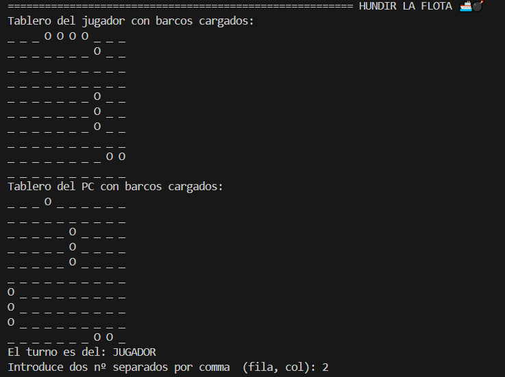

# Hundir la Flota 💣🚢
  

**Hundir la Flota** es un clásico juego de estrategia por turnos en el que cada jugador intenta hundir los barcos del oponente adivinando sus posiciones en un tablero oculto. En la versión actual, el **jugador** compite contra la **ordenador**, ambos con sus respectivas flotas colocadas estratégicamente. Gana quien logre primero hundir todos los barcos enemigos.


## 📝 Descripción del juego
**Hundir la Flota** es un juego por turnos entre un jugador humano y el ordenador. Cada jugador tiene una flota de barcos colocados en secreto en una cuadrícula (normalmente de 10x10). Ambos jugadores se turnan para anunciar las coordenadas donde creen que se encuentran los barcos del oponente. Si aciertan, se marca un «**tocado**»; si logran golpear todas las posiciones de un barco, se considera «**hundido**».

🎯 **Objetivo**: Hundir todos los barcos del ordenador antes de que ella hunda los tuyos.
### ✨ Características

* **Modo jugador VS ordenador**
* **Tablero customizable**
* **Feedback en tiempo real** 
* **Colocación de barcos aleatoria**

## ⚙️ Requisitos
* Python
* Librerias básicas
```python
numpy, random, time, emoji, termcolor
```
## 📦 Instalación

```bash
pass
```
## 🕹️ Instrucciones de juego
Ejecuta el programa y sigue las indicaciones que aparecerán en pantalla. Introduce las coordenadas del disparo usando el formato correcto (por ejemplo: 3,5). Tu objetivo es hundir toda la flota enemiga antes de que el ordenador hunda la tuya.
### 🔁 Reglas del juego

    Si aciertas un disparo, puedes seguir jugando en el mismo turno.

    Si fallas (disparas al agua), el turno pasa al ordenador.

    El juego termina cuando:

        Hundes todos los barcos del enemigo (Felicidades! 🏆), o

        El ordenador hunde todos tus barcos (¡Derrota! 😢).

## 📂 Estructura del proyecto
```bash
Hundir_la_flota/
├── main.py      # Script principal del juego
├── utils.py     # Lógica del juego y configuraciones
└── README.md    # Documentación del proyecto
```

## 🛠️ Customización

Se puede ajustar el tamaño del tablero, la cantidad de barcos editando las variables configurables al inicio de _utils.py_.

```python
 TAMANO_TABLERO = 10 # Cambiar tamaño del tablero   
 NUMERO_BARCOS = 5 # Cambiar número de barcos 
```

## ▶️ Ejemplo de uso
```bash
python main.py
```
