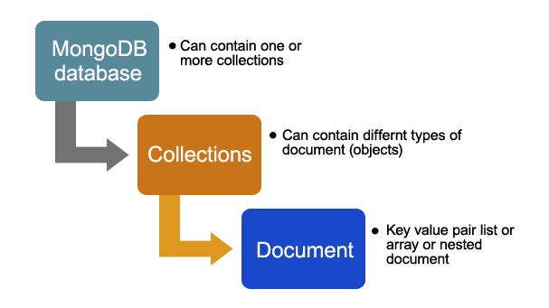

# **BOOTCAMP FULLSTACK**

## Fullstack FT Vitoria Abril 2025
---

## Intro a BBDD NoSQL con MongoDB


- [Qué son las bases de datos NoSQL](https://aws.amazon.com/es/nosql/)
- [Documentación MongoDB](https://docs.mongodb.com/guides/)
- [MongoDB](https://www.mongodb.com/es)
- [que-es-mongodb](https://openwebinars.net/blog/que-es-mongodb/)

### ¿Qué es MongoDB?

MongoDb es un tipo de bases de datos no relacional `noSQL` orientada a documentos.


**NoSQL** significa "**Not Only SQL**" (No sólo SQL). Es un término general que se usa para referirse a **sistemas de bases de datos que no siguen el modelo relacional tradicional** (basado en tablas y SQL).

Estas bases de datos están diseñadas para manejar grandes cantidades de datos no estructurados o semi-estructurados, y ofrecen una mayor flexibilidad en cuanto a cómo se almacenan y acceden los datos.

Las BBDD de mongeDB se almacenan en un formato tipo BSON es un JSON pero mas efectivo.

**Diferencias entre json y bson**

- [json-and-bson](https://www.mongodb.com/json-and-bson)

1. JSON solo admite una cantidad limitada de tipos de datos básicos. En particular, JSON carece de soporte para fechas y datos binarios.

2. Los objetos y las propiedades JSON no tienen una longitud fija, lo que hace que el recorrido sea más lento.
---

### Características comunes de NoSQL:

1. **No requieren esquemas fijos**
   Puedes almacenar datos sin definir previamente una estructura estricta.

2. **Escalabilidad horizontal**
   Se pueden distribuir fácilmente entre múltiples servidores.

3. **Alto rendimiento para ciertas operaciones**
   Son muy rápidas para consultas específicas, especialmente en grandes volúmenes de datos.

4. **Diversos modelos de datos**
   Existen varios tipos de bases de datos NoSQL:

   * **Documentales** (como MongoDB)
   * **Clave-valor** (como Redis)
   * **Columnas anchas** (como Cassandra)
   * **Grafos** (como Neo4j)

#### ¿Por qué usar NoSQL?

* Cuando necesitas **alta escalabilidad y rendimiento**.
* Cuando trabajas con **datos que cambian de estructura** frecuentemente.
* Cuando manejas **grandes volúmenes de datos** como logs, redes sociales, IoT (Internet of Things), etc.


No existe una relación directa entre sus elementos a diferencia de las relacionales, no se agrupan por tablas, llaves primarias, foraneas ...


## MongoDB vs SQL ¿Cuándo usar cada una?

### SQL vs NoSQL: Diferencias clave

#### SQL (Bases de datos relacionales)
- **Estructura**: Basadas en tablas con filas y columnas. Los datos se organizan en relaciones (tablas).
- **Esquema**: Esquema fijo y predefinido. Los datos deben ajustarse a una estructura rígida.
- **Consultas**: Utilizan SQL (Structured Query Language) para realizar consultas y operaciones.
- **Escalabilidad**: Escalabilidad vertical (aumentar recursos en un solo servidor).
- **Integridad**: Garantizan integridad referencial y transacciones ACID (Atomicidad, Consistencia, Aislamiento, Durabilidad).
- Aplicaciones con datos estructurados, como sistemas financieros, ERP, CRM, etc.

#### NoSQL (Bases de datos no relacionales)
- **Estructura**: Basadas en documentos, clave-valor, grafos o columnas. Los datos no tienen una estructura fija.
- **Esquema**: Esquema flexible o sin esquema. Permite almacenar datos no estructurados o semiestructurados.
- **Consultas**: Lenguajes específicos según el tipo de base de datos (por ejemplo, consultas JSON en MongoDB).
- **Escalabilidad**: Escalabilidad horizontal (añadir más servidores para manejar la carga).
- **Flexibilidad**: Diseñadas para manejar grandes volúmenes de datos y alta velocidad de escritura/lectura.
- Big Data, aplicaciones en tiempo real, redes sociales, IoT, etc.

#### Comparación
| Característica       | SQL                          | NoSQL                        |
|----------------------|------------------------------|------------------------------|
| **Modelo de datos**  | Relacional                  | No relacional                |
| **Esquema**          | Fijo                        | Flexible                     |
| **Escalabilidad**    | Vertical                    | Horizontal                   |
| **Transacciones**    | ACID                        | Eventualmente consistentes   |
| **Velocidad**        | Más lento en grandes datos  | Optimizado para grandes datos|
| **Casos de uso**     | Datos estructurados         | Datos no estructurados       |

**Diferencia breve entre escalabilidad horizontal y vertical**

- *Escalabilidad vertical*:
  Aumentar la **potencia de un solo servidor** (más CPU, RAM, disco).
  *Mejoras el hardware del mismo equipo.*

* *Escalabilidad horizontal*:
  Agregar **más servidores** al sistema para repartir la carga.
  *Conectas varios equipos para trabajar juntos.*

**Transacciones ACID (breve explicación):**

es un conjunto de propiedades que garantizan que una transacción en una base de datos sea **segura y confiable**.

Significa:

- **A – Atomicidad:** Todo ocurre o nada ocurre. Si una parte falla, se revierte todo.
- **C – Consistencia:** La base de datos pasa de un estado válido a otro válido. No queda en un estado "roto".

- **I – Aislamiento:** Las transacciones no se afectan entre sí, aunque ocurran al mismo tiempo.

- **D – Durabilidad:** Una vez que la transacción se completa, los datos quedan guardados, incluso si hay un apagón.


#### Recursos adicionales
- [SQL vs NoSQL | DigitalOcean](https://www.digitalocean.com/community/tutorials/sql-vs-nosql-databases)
- [SQL vs NoSQL | AWS](https://aws.amazon.com/nosql/)
- [MongoDB | mongodb-mysql](https://www.mongodb.com/es/resources/compare/mongodb-mysql)
- [AWS | the-difference-between-mongodb-vs-mysql](https://aws.amazon.com/es/compare/the-difference-between-mongodb-vs-mysql/)

- [7-razones-mongodb](https://platzi.com/blog/7-razones-mongodb/)
- [mysql-vs-mongodb-cuando-y-donde-usar-cada-uno](https://impactotecno.wordpress.com/2018/02/26/mysql-vs-mongodb-cuando-y-donde-usar-cada-uno)
- [mongodb-como-funciona](https://siliconnews.plataformasinc.es/mongodb-como-funciona/)
---

### MongoDB - Ejemplos de apps - casos de uso


**Aplicaciones de redes sociales**
- Almacenar perfiles de usuarios, publicaciones, comentarios, reacciones y mensajes.
- Su esquema flexible permite manejar datos no estructurados y cambiar la estructura de los documentos sin afectar la base de datos.

**Comercio electrónico**
- Gestión de catálogos de productos, carritos de compra, historial de pedidos y reseñas de clientes.
- **Razón para usar MongoDB**: La capacidad de manejar datos jerárquicos como productos con múltiples variantes y atributos.

**Aplicaciones de IoT (Internet de las cosas)**
- Almacenar datos de sensores, registros de eventos y análisis en tiempo real.
- **Razón para usar MongoDB**: Su capacidad para manejar grandes volúmenes de datos y realizar consultas rápidas.

**Sistemas de análisis de datos**
- Procesar y analizar grandes volúmenes de datos para obtener información útil.
- **Razón para usar MongoDB**: Su soporte para operaciones de agregación y consultas complejas.

**Aplicaciones de contenido multimedia**
- Almacenar metadatos de imágenes, videos y archivos de audio.
- **Razón para usar MongoDB**: Su capacidad para manejar datos no estructurados y consultas rápidas.

**Gestión de contenido (CMS)**
- Almacenar y gestionar contenido dinámico como blogs, páginas web y artículos.
- **Razón para usar MongoDB**: Su flexibilidad para manejar diferentes tipos de contenido y estructuras.

**Aplicaciones de geolocalización**
- Almacenar datos de ubicación, realizar búsquedas cercanas y análisis geoespacial.
- **Razón para usar MongoDB**: Su soporte para índices geoespaciales y consultas relacionadas.

**Aplicaciones financieras**
- Gestión de transacciones, análisis de riesgos y detección de fraudes.
- **Razón para usar MongoDB**: Su capacidad para manejar datos en tiempo real y realizar análisis complejos.

**Big Data y análisis en tiempo real**
- Procesar grandes volúmenes de datos generados por usuarios o sistemas.
- **Razón para usar MongoDB**: Su escalabilidad horizontal y soporte para particionamiento.

**Aplicaciones de mensajería y chat**
- Almacenar mensajes, historial de conversaciones y datos de usuarios.
- **Razón para usar MongoDB**: Su capacidad para manejar datos no estructurados y consultas rápidas.

#### Recursos adicionales
- [MongoDB | Casos de uso](https://www.mongodb.com/solutions/use-cases)
- [Real-world use cases of MongoDB](https://www.knowledgehut.com/blog/web-development/real-world-use-cases-of-mongodb)
- [MongoDB use case examples](https://hevodata.com/learn/mongodb-use-case/)
- [mongodb-real-world-use-cases](https://www.upgrad.com/blog/mongodb-real-world-use-cases/)

---

### NoSQL con MongoDB - Estructura

**[Colecciones y documentos](https://www.mongodb.com/docs/manual/core/databases-and-collections/)**



**Colecciones**
  
**Documentos**
  
---

---
### Modelado de datos en MongoDB

#### Modelo de datos embebido

- [MongoDB | model-embedded-one-to-one-relationships-between-documents](https://docs.mongodb.com/manual/tutorial/model-embedded-one-to-one-relationships-between-documents/)

El modelo de datos embebido en MongoDB consiste en almacenar datos relacionados dentro de un mismo documento en lugar de dividirlos en múltiples colecciones. Este enfoque es útil cuando los datos relacionados se consultan juntos con frecuencia, ya que reduce la necesidad de realizar uniones o múltiples consultas.

##### Ventajas:
- **Rendimiento mejorado**: Las consultas son más rápidas porque los datos relacionados están en el mismo documento.
- **Simplicidad**: Menos necesidad de realizar uniones o referencias entre colecciones.
- **Atomicidad**: Las operaciones de escritura en un solo documento son atómicas.

##### Desventajas:
- **Tamaño del documento**: Los documentos tienen un límite de 16 MB, lo que puede ser un problema si los datos embebidos son muy grandes.
- **Redundancia**: Puede haber duplicación de datos si los mismos datos embebidos se repiten en múltiples documentos.

##### Ejemplo:
Supongamos que tenemos una base de datos para gestionar pedidos de una tienda en línea. Un modelo embebido podría verse así:

```json
{
    "_id": 1,
    "cliente": {
        "nombre": "Juan Pérez",
        "email": "juan.perez@example.com"
    },
    "productos": [
        {
            "nombre": "Laptop",
            "cantidad": 1,
            "precio": 1200
        },
        {
            "nombre": "Mouse",
            "cantidad": 2,
            "precio": 25
        }
    ],
    "fecha": "2023-10-01",
    "total": 1250
}
```

En este ejemplo, los datos del cliente y los productos están embebidos dentro del documento del pedido.

##### Casos de uso:
- Datos que tienen una relación uno a pocos o pocos a pocos.
- Datos que se consultan juntos con frecuencia.
- Escenarios donde los datos relacionados no cambian con frecuencia.

##### Más información:
- [MongoDB | Model Embedded Relationships](https://www.mongodb.com/docs/manual/tutorial/model-embedded-one-to-one-relationships-between-documents/)
- [MongoDB | Data Modeling](https://www.mongodb.com/docs/manual/core/data-model-design/)
- [MongoDB | Embedded Data Models](https://www.mongodb.com/docs/manual/core/data-models-embedded/)


#### Modelo de datos normalizado
  
- [MongoDB | database-references](https://docs.mongodb.com/manual/reference/database-references/)

El modelo de datos normalizado en MongoDB implica dividir los datos relacionados en múltiples colecciones y establecer referencias entre ellas. Este enfoque es útil cuando los datos relacionados cambian con frecuencia o cuando se necesita evitar la duplicación de datos.

##### Ventajas:
- **Reducción de redundancia**: Minimiza la duplicación de datos, lo que ahorra espacio de almacenamiento.
- **Mantenimiento más sencillo**: Los cambios en los datos relacionados solo necesitan realizarse en un lugar.
- **Escalabilidad**: Facilita la gestión de datos complejos y relaciones entre ellos.

##### Desventajas:
- **Consultas más complejas**: Requiere realizar múltiples consultas o uniones para obtener datos relacionados.
- **Rendimiento**: Las consultas pueden ser más lentas debido a la necesidad de combinar datos de varias colecciones.


Más info:

- [MongoDB | data-model-design](https://docs.mongodb.com/manual/core/data-model-design/)
- [MongoDB - Relationships | Tutorialspoint](https://www.tutorialspoint.com/mongodb/mongodb_relationships.htm)

- [Manual](https://www.mongodb.com/docs/manual/)
- [SQL vs NoSQL | Cuándo usar cada uno](https://www.mongodb.com/nosql-explained)
- [Relational Databases | IBM](https://www.ibm.com/topics/relational-databases)
- [SQL vs NoSQL | AWS](https://aws.amazon.com/nosql/)


##### Ejemplo:
Supongamos que tenemos una base de datos para gestionar pedidos de una tienda en línea. Un modelo normalizado podría verse así:

**Colección de clientes:**
```json
{
    "_id": 1,
    "nombre": "Juan Pérez",
    "email": "juan.perez@example.com"
}
```

**Colección de pedidos:**
```json
{
    "_id": 101,
    "cliente_id": 1,
    "fecha": "2023-10-01",
    "total": 1250
}
```

**Colección de productos:**
```json
{
    "_id": 201,
    "pedido_id": 101,
    "nombre": "Laptop",
    "cantidad": 1,
    "precio": 1200
},
{
    "_id": 202,
    "pedido_id": 101,
    "nombre": "Mouse",
    "cantidad": 2,
    "precio": 25
}
```

En este ejemplo, los datos del cliente, los pedidos y los productos están separados en diferentes colecciones, y las relaciones se establecen mediante identificadores.

##### Casos de uso:
- Datos que tienen relaciones uno a muchos o muchos a muchos.
- Escenarios donde los datos relacionados cambian con frecuencia.
- Aplicaciones que requieren evitar la duplicación de datos.


##### Más información:
- [MongoDB | database-references](https://docs.mongodb.com/manual/reference/database-references/)
- [MongoDB | Data Modeling](https://www.mongodb.com/docs/manual/core/data-model-design/)
- [MongoDB | Model Referenced Relationships](https://www.mongodb.com/docs/manual/tutorial/model-referenced-one-to-many-relationships-between-documents/)
- [MongoDB - Relationships | Tutorialspoint](https://www.tutorialspoint.com/mongodb/mongodb_relationships.htm)

---

## Instalacion
<details>
<summary>En windows:</summary>

- [Instrucciones](https://www.mongodb.com/docs/manual/tutorial/install-mongodb-on-windows/)

**INSTALAR COMUNITY SERVER**

- [Instrucciones](https://www.mongodb.com/try/download/community?tck=docs_server)
- [Instrucciones mongo-shell](https://www.mongodb.com/docs/mongodb-shell/install/)
- [Instalador](https://www.mongodb.com/try/download/shell?jmp=docs)

agregar mongosh al PATH en las variables de entorno
</details>

<details>
<summary>En Mac:</summary>

- [Instrucciones](https://www.mongodb.com/docs/manual/tutorial/install-mongodb-on-os-x/)

```
	brew tap mongodb/brew
	brew update
```

**Instalar**

```
	brew install mongodb-community@6.0
```

**Arrancar servicios**

```
	brew services start mongodb-community
```

**Parar servicios**

```
	brew services stop mongodb-community@6.0
```

**Resetear servicios**

```
	brew services restart mongodb-community
```

**SI FALLA**

```mongoDB

	which mongod

	find / -name 'mongod'

	 /usr/local/mongodb/bin/mongod

	 echo "PATH=/usr/local/mongodb/bin/:$PATH" >> ~/.bash_profile . ~/.bash_profile

	 mongod --dbpath /your/path

	 brew services start mongodb-community

	  brew services list
		mongodb-community stopped
		brew services start mongodb-community
		==> Successfully started `mongodb-community` (label: homebrew.mxcl.mongodb-community)
```


## Iniciar mongo shell

```node
mongosh;
```
</details>

---

## Conectar con MongoAtlas
<details>

**Abrir Mongo Atlas**
2. Conectar por defecto
   mongodb://localhost:27017

3. Crear base de datos ej. personas
   Crear colleccion ej. Alumnos

   {
   "\_id": {
   "$oid": "6339611396d6f9c37cdd8053"
   },
   "nombre": "Pepe",
   "edad": 20
   }
</details>

---
### Comandos básicos mongo shell

**Mostrar todas las bases de datos**

```mongoDb
    show dbs
```

**Entrar en una base de datos concreta**

```mongoDb
    use <nombreBaseDatos>
    ej: use personas
```

**Crear una base de datos**

```mongoDb
    use <nombreBaseDatos>
    ej: use tienda
```

si hacemos "show dbs" aún no muestra nada, esto es porque con este comando sólo muestra las bases de datos donde hay al menos una colección

**Ver las collecciones de una base de datos**

```mongoDb
    //seleccionamos la base de datos
        use personas

    //ver las colecciones
        show collections
```

**Acceder a los datos de una collección**

```mongoDb
    db.<nombreColeccion>.find()
    ej: db.alumnos.find()
```
---
### CRUD (create, read, uptade y delete)

### Create

**Añadir un documento a la collección**

```javascript
    db.clientes.insertOne(
      {
        nombre: "Laura Pérez",
        email: "laura.perez@example.com",
        telefono: ["+34 600123456", "+34 699987654"],
        direcciones: [
          {
            tipo: "casa",
            calle: "Calle Mayor 123",
            ciudad: "Madrid",
            pais: "España"
          },
          {
            tipo: "trabajo",
            calle: "Av. de América 45",
            ciudad: "Madrid",
            pais: "España"
          }
        ],
        compras: [
          { producto: "Laptop", precio: 1200, fecha: "2024-03-15" },
          { producto: "Ratón", precio: 25, fecha: "2024-04-22" }
        ]
      }
    )
```


**Añadir varios documentos a la collección**


```javascript
  db.clientes.insertMany([
    {
      nombre: "Laura Gómez",
      email: "laura.gomez@example.com",
      telefono: ["+34 600123456", "+34 699987654"],
      direcciones: [
        {
          tipo: "casa",
          calle: "Calle Mayor 123",
          ciudad: "Madrid",
          pais: "España"
        },
        {
          tipo: "trabajo",
          calle: "Av. de América 45",
          ciudad: "Madrid",
          pais: "España"
        }
      ],
      compras: [
        { producto: "Laptop", precio: 1200, fecha: "2024-03-15" },
        { producto: "Ratón", precio: 25, fecha: "2024-04-22" }
      ]
    },
    {
      nombre: "Carlos Ruiz",
      email: "carlos.ruiz@example.com",
      telefono: ["+34 611234567"],
      direcciones: [
        {
          tipo: "casa",
          calle: "Calle de Alcalá 58",
          ciudad: "Madrid",
          pais: "España"
        }
      ],
      compras: []
    },
    {
      nombre: "María López",
      email: "maria.lopez@example.com",
      telefono: ["+34 612345678"],
      direcciones: [
        {
          tipo: "casa",
          calle: "Calle Princesa 10",
          ciudad: "Barcelona",
          pais: "España"
        }
      ],
      compras: [
        { producto: "Tablet", precio: 350, fecha: "2023-11-10" }
      ]
    },
    {
    nombre: "José Martínez",
      email: "jose.martinez@example.com",
      telefono: ["+34 613456789"],
      direcciones: [],
      compras: [
        { producto: "Monitor", precio: 200, fecha: "2024-05-01" },
        { producto: "Teclado", precio: 50, fecha: "2024-05-02" }
      ]
    },
    {
      nombre: "Ana Torres",
      email: "ana.torres@example.com",
      telefono: [],
      direcciones: [
        {
          tipo: "casa",
          calle: "Rambla Catalunya 33",
          ciudad: "Barcelona",
          pais: "España"
        }
      ],
      compras: []
    },
    {
      nombre: "David Fernández",
      email: "david.fernandez@example.com",
      telefono: ["+34 614567890"],
      direcciones: [
        {
          tipo: "trabajo",
          calle: "Paseo de Gracia 22",
          ciudad: "Barcelona",
          pais: "España"
        }
      ],
      compras: [
        { producto: "Auriculares", precio: 80, fecha: "2024-02-14" }
      ]
    },
    {
    nombre: "Lucía Navarro",
      email: "lucia.navarro@example.com",
      telefono: ["+34 615678901"],
      direcciones: [],
      compras: [
        { producto: "Smartphone", precio: 900, fecha: "2023-12-20" },
        { producto: "Cargador", precio: 30, fecha: "2024-01-05" }
      ]
    },
    {
      nombre: "Miguel Álvarez",
      email: "miguel.alvarez@example.com",
      telefono: [],
      direcciones: [],
      compras: []
    },
    {
      nombre: "Isabel Romero",
      email: "isabel.romero@example.com",
      telefono: ["+34 616789012"],
      direcciones: [
        {
          tipo: "casa",
          calle: "Gran Vía 80",
          ciudad: "Valencia",
          pais: "España"
        }
      ],
      compras: [
        { producto: "Impresora", precio: 150, fecha: "2024-06-01" }
      ]
    },
    {

      nombre: "Raúl Díaz",
      email: "raul.diaz@example.com",
      telefono: ["+34 617890123"],
      direcciones: [
        {
          tipo: "trabajo",
          calle: "Av. Constitución 100",
          ciudad: "Sevilla",
          pais: "España"
        }
      ],
      compras: []
    }
  ])

```


### Read

**Leer todos los documentos**

```mongoDB
db.clientes.find()
```

**Leer x cantidad de elementos**

```mongoDB
db.clientes.find().limit(2)
```

**Leer accediendo por filtro**

```mongoDB
db.clientes.find({ nombre: "Laura Gómez" })
db.clientes.find({ "direcciones.ciudad": "Barcelona" })
```

**Comparadores**

  - gt -> greater than -> >
  - gte -> greater than equal -> >=
  - lt -> lower than -> >
  - lte -> lower than equal -> >=

```mongoDB

db.clientes.find({"fecha_alta":{$gte: ISODate("2022-01-12")}})
db.clientes.find({"antiguedad":{$lte:3}})
db.clientes.find({"antiguedad":{$gte:3}})
```

**PROYECCIONES**
Las proyecciones en MongoDB se utilizan para seleccionar qué campos quieres incluir o excluir al consultar documentos en una colección.

```mongoDB
db.<nombreColeccion>.find(query,projeccion)
//8. Mostrar solo nombre y email (sin _id)
db.clientes.find({}, { nombre: 1, email: 1, _id: 0 })

db.clientes.find({"antiguedad":{$lt:4}}, {"nombre":1,"ciudad":1})
db.clientes.find({"antiguedad":{$lt:4}}, {"nombre":1,"ciudad":1}).limit(2)

//si no queremos mostrar el id
db.clientes.find({antiguedad:{$lt:4}}, {nombre:1,ciudad:1,_id:0}).limit(2)

//si queremos que muestre todo menos algo
db.clientes.find({antiguedad:{$lt:4}}, {nombre:0,ciudad:0,_id:0}).limit(2)

//Mostrar todos los registros pero sin X campos
db.clientes.find({},{nombre:0,ciudad:0,_id:0})
```

**si existe o no existe**

```mongoDB
db.clientes.find({articulos:{$exists:true}})
db.clientes.find({articulos:{$exists:false}})

// Clientes que tengan más de un número de teléfono
db.clientes.find({ "telefono.1": { $exists: true } })
```

**Leer una propiedad de un objeto**

```mongoDB
db.clientes.find({ "compras.producto": "Laptop" })

// Clientes con al menos una compra de más de 500€
db.clientes.find({ "compras.precio": { $gt: 500 } })

```

**Leer de un array**

```mongoDB
db.productos.find( { colores: { $in: ["allo" ]} } )
// Clientes que no han hecho ninguna compra
db.clientes.find({ compras: { $eq: [] } })
```

**OR**

```mongoDB
 db.productos.find( { $or: [ { colores: "allo" }, { colores: "rojo" } ] } )
 db.clientes.find({$or:[ {estado:false}, {antiguedad:3}]  })
```

**OR y AND**

```mongoDB
db.clientes.find({ ciudad: "granada" ,  $or:[ {estado:false}, {antiguedad:3}]  })
```

**Ordenar**

```mongoDB
// Clientes ordenados por nombre (ascendente)
db.clientes.find().sort({ nombre: 1 })

// Clientes ordenados por nombre (descendente)
db.clientes.find().sort({ nombre: 0 })
```

### UPDATE

**Actualizar un documento**

```mongoDB
db.<nombreColeccion>.updateOne({_id;ObjectId("xxxxxxxxxx")},{$set: {llave:valor}})

//Actualizar el email de un cliente específico
db.clientes.updateOne(
  { nombre: "Laura Gómez" },
  { $set: { email: "laura.nueva@example.com" } }
)
//Agregar un nuevo número de teléfono
db.clientes.updateOne(
  { nombre: "Carlos Ruiz" },
  { $push: { telefono: "+34 611000000" } }
)


// Agregar una nueva compra (append al array)
db.clientes.updateOne(
  { nombre: "María López" },
  {
    $push: {
      compras: {
        producto: "Funda Tablet",
        precio: 20,
        fecha: "2025-06-02"
      }
    }
  }
)

```

**Actualizar varios registros**

```mongoDB
db.<nombreColeccion>.updateMany({filtro},{$set: {llave:valor}},{opciones})
// Agregar un nuevo campo a todos los clientes
db.clientes.updateMany(
  {},
  { $set: { activo: true } }
)
// Actualizar a todos los clientes de Barcelona
db.clientes.updateMany(
  { "direcciones.ciudad": "Barcelona" },
  { $set: { ciudadPrincipal: "Barcelona" } }
)

//Agregar un número de teléfono común a todos los clientes sin teléfono
db.clientes.updateMany(
  { telefono: { $eq: [] } },
  { $push: { telefono: "+34 600000000" } }
)
//Aumentar el precio de todos los productos comprados en un 10%
db.clientes.updateMany(
  {},
  { $mul: { "compras.$[].precio": 1.1 } }
)

// Si añadimos un campo que no existe lo creara
db.clientes.updateMany(
  {antiguedad: {$gte:4}},
  {$set: {mas_de:1}}
)


//actualizar e insertar un array
db.clientes.updateMany(
  {},
  {$set: {"compras":["compra1","compra2"]}}
)

```

**Otros operadoresde actualización además del $set (modificadores de campo)**
    - [Operadores de actualización](https://www.mongodb.com/docs/manual/reference/operator/update/)

```mongoDB
//AÑADIMOS PARA EL EJEMPLO
db.clientes.updateMany({ },{$set: {descuento:true}})

//Esta consulta elimina el campo requiereContacto en todos los clientes que sí tienen al menos un número de teléfono registrado.
db.clientes.updateMany(
  { telefono: { $exists: true, $ne: [] } },
  { $unset: { requiereContacto: true } }
)

//Supongamos que accidentalmente en algunos documentos de clientes se agregó un campo notaAdicional: "" (una cadena vacía), y queremos eliminar ese campo si está vacío.
db.clientes.updateMany(
  { notaAdicional: "" },
  { $unset: { notaAdicional: "" } }
)
```

**Otros operadores para actualizar arrays**

```mongoDB
//añadir un alemento al array sólo si no existe $addToSet
db.clientes.updateMany(
  {_id: ObjectId("6339c38fb48767c8a9e311b7")},
  {$addToSet:{"articulos":'nuevo articulo'}}
)

//añadir un alemento al array aunque exista $push
db.clientes.updateMany(
  {_id: ObjectId("6339c38fb48767c8a9e311b7")},
  {$push:{"articulos":'nuevo articulo'}}
)

//Elimina el último (1) o el primer (-1) elemento del array $pop
db.clientes.updateMany(
  {_id: ObjectId("6339c38fb48767c8a9e311b7")},
  {$pop:{"articulos":1}}
)
db.clientes.updateMany(
  {_id: ObjectId("6339c38fb48767c8a9e311b7")},{$pop:{"articulos":-1}}
)

//Eliminar todos los elementos que coincidan con la consulta $pull
db.clientes.updateMany(
  {_id: ObjectId("6339c38fb48767c8a9e311b7")},
  {$pull:{"articulos":"compra3"}}
  )

//Eliminar todos los elementos que coincidan con varias consultas $pullAll
db.clientes.updateMany(
  {_id: ObjectId("6339c38fb48767c8a9e311b7")},
  {$pullAll:{"articulos":["nuevo articulo", "nueva compra2"]}}
)
```

**Modificadores de arrays**

```mongoDB
//$each -> permite añadir varios elementos
db.clientes.updateMany(
  { _id: ObjectId("6339c38fb48767c8a9e311b7") },
  {
    $push: {
      articulos: {
        $each: [
          { rating: 2, comentario: "este es el comentario" },
          { rating: 5, comentario: "este es el comentario de 5" }
        ]
      }
    }
  }
)

```

**UPSERTS** 
{upsert: true} -> Si el documento con, se actualiza, Si no existe, entonces se crea un nuevo documento.
{upsert: false} -> Si lo encuentra, actualiza el campo, si no encuentra no hace nada (no crea ningún documento nuevo).

```mongoDB
db.collection.updateOne( <filter>,<update>,{ upsert: <boolean>} )

db.clientes.updateOne(
  {_id:ObjectId("63397eccb48767c8a9e312ac")},
  {$set:{ciudad:"malaga"}},{upsert:true}
)
```

### Delete

**Reemplazar**
replaceOne - obliga a cambiar todo el documento, No se pueden utilizar operadores de actualización

```mongoDB
db.clientes.replaceOne(
  {_id: ObjectId("6339c38fb48767c8a9e311b7")},
  {"nombre":"Ana", "apellidos":"martin"}
)
db.clientes.replaceOne(
  {"nombre":"Lola"},
  {"nombre":"Lolita", "apellidos":"martin"},{upsert:true}
)
```

**Eliminar**

1. deleteOne

```mongoDB
db.clientes.deleteOne({_id: ObjectId("6339c38fb48767c8a9e311b7")})
```

2. deleteMany

```mongoDB
db.clientes.deleteMany({antiguedad: 6})
db.clientes.deleteMany({nombre: "Lolita"})
```
---
### MongoDB - Agregación

Las operaciones basadas en agregaciones nos permiten procesar datos registrados para obtener resultados que aportan información útil. Es deir, la agregación es un proceso para transformar y combinar datos de una o más colecciones, produciendo resultados complejos y resumidos.

La agregación en MongoDB funciona como una cadena de procesamiento llamada pipeline (tubería).

   - Los datos entran por la primera etapa.

   - Cada etapa realiza una operación específica (filtrar, agrupar, ordenar, transformar, etc.).

   - La salida de una etapa es la entrada para la siguiente.

   - Así, los datos se van transformando paso a paso hasta obtener el resultado final.

Es como una línea de montaje donde cada estación hace un trabajo diferente sobre el producto antes de pasarlo a la siguiente.

**Ejemplo de Pipeline de agregación:**
```javascript
db.clientes.aggregate([
  { $match: {} }, // (1) Opcional: filtra documentos (aquí no filtramos nada)
  { $group: { _id: "$ciudad", totalClientes: { $sum: 1 } } }, // (2) Agrupar por ciudad
  { $sort: { totalClientes: -1 } } // (3) Ordenar de mayor a menor
])
```

#### Principales etapas del pipeline de agregación:
1. **$match**: Filtra documentos según criterios específicos (similar a `find`).
2. **$group**: Agrupa documentos por un campo y realiza cálculos agregados (como sumas, promedios, etc.).
3. **$project**: Selecciona y transforma campos en los documentos de salida.
4. **$sort**: Ordena los documentos por uno o más campos.
5. **$limit**: Limita el número de documentos en la salida.
6. **$skip**: Omite un número específico de documentos.
7. **$unwind**: Descompone arrays en documentos individuales.
8. **$lookup**: Realiza un "join" entre colecciones.
9. **$addFields**: Agrega nuevos campos a los documentos.

#### Ejemplos de agregación en MongoDB

##### 1. Filtrar documentos con `$match`
Filtrar empleados con salario mayor a 6000:
```bash
db.employees.aggregate([
    { $match: { salary: { $gt: 6000 } } }
]);
```

##### 2. Agrupar documentos con `$group`
Agrupar empleados por departamento y calcular el total de salarios:
```bash
db.employees.aggregate([
    { $group: { _id: "$department.name", totalSalaries: { $sum: "$salary" } } }
]);
```

##### 3. Seleccionar campos con `$project`
Mostrar solo el nombre completo y el salario de los empleados:
```bash
db.employees.aggregate([
    { $project: { fullName: { $concat: ["$firstName", " ", "$lastName"] }, salary: 1, _id: 0 } }
]);
```

##### 4. Ordenar documentos con `$sort`
Ordenar empleados por salario en orden descendente:
```bash
db.employees.aggregate([
    { $sort: { salary: -1 } }
]);
```

##### 5. Limitar resultados con `$limit`
Obtener los 3 empleados con los salarios más altos:
```bash
db.employees.aggregate([
    { $sort: { salary: -1 } },
    { $limit: 3 }
]);
```

##### 6. Descomponer arrays con `$unwind`
Supongamos que cada empleado tiene un array de habilidades (`skills`). Para descomponer este array:
```bash
db.employees.aggregate([
    { $unwind: "$skills" }
]);
```

##### 7. Realizar un "join" con `$lookup`
Unir empleados con otra colección llamada `departments`:
```bash
db.employees.aggregate([
    { $lookup: {
        from: "departments",
        localField: "department.name",
        foreignField: "name",
        as: "departmentDetails"
    } }
]);
```

##### 8. Agregar nuevos campos con `$addFields`
Agregar un campo `bonus` que sea el 10% del salario:
```bash
db.employees.aggregate([
    { $addFields: { bonus: { $multiply: ["$salary", 0.1] } } }
]);
```
### Ejemplo de MongoDB con Pipeline de Aggregation

#### Añadir documentos a la colección `ventas`
```bash
db.ventas.insertMany([
    { _id: 1, producto: "Laptop", categoria: "Electrónica", precio: 1200, cantidad: 5, fecha: new Date("2023-10-01") },
    { _id: 2, producto: "Mouse", categoria: "Electrónica", precio: 25, cantidad: 50, fecha: new Date("2023-10-02") },
    { _id: 3, producto: "Teclado", categoria: "Electrónica", precio: 45, cantidad: 30, fecha: new Date("2023-10-03") },
    { _id: 4, producto: "Silla", categoria: "Muebles", precio: 150, cantidad: 10, fecha: new Date("2023-10-04") },
    { _id: 5, producto: "Mesa", categoria: "Muebles", precio: 300, cantidad: 5, fecha: new Date("2023-10-05") },
    { _id: 6, producto: "Monitor", categoria: "Electrónica", precio: 200, cantidad: 20, fecha: new Date("2023-10-06") },
    { _id: 7, producto: "Lámpara", categoria: "Muebles", precio: 50, cantidad: 15, fecha: new Date("2023-10-07") },
    { _id: 8, producto: "Auriculares", categoria: "Electrónica", precio: 80, cantidad: 25, fecha: new Date("2023-10-08") },
    { _id: 9, producto: "Impresora", categoria: "Electrónica", precio: 300, cantidad: 8, fecha: new Date("2023-10-09") },
    { _id: 10, producto: "Estantería", categoria: "Muebles", precio: 100, cantidad: 12, fecha: new Date("2023-10-10") }
]);
```

#### Pipeline de Aggregation

1. **Filtrar productos de la categoría "Electrónica" con `$match`**:
   ```bash
   db.ventas.aggregate([
       { $match: { categoria: "Electrónica" } }
   ]);
   ```

2. **Agrupar por categoría y calcular el total de ingresos con `$group`**:
   ```bash
   db.ventas.aggregate([
       { $group: { _id: "$categoria", totalIngresos: { $sum: { $multiply: ["$precio", "$cantidad"] } } } }
   ]);
   ```

3. **Ordenar los productos por precio descendente con `$sort`**:
   ```bash
   db.ventas.aggregate([
       { $sort: { precio: -1 } }
   ]);
   ```

4. **Proyectar campos específicos con `$project`**:
   ```bash
   db.ventas.aggregate([
       { $project: { producto: 1, precio: 1, ingresos: { $multiply: ["$precio", "$cantidad"] }, _id: 0 } }
   ]);
   ```

5. **Limitar los resultados a los 3 productos más vendidos con `$limit`**:
   ```bash
   db.ventas.aggregate([
       { $sort: { cantidad: -1 } },
       { $limit: 3 }
   ]);
   ```

6. **Calcular el total de ingresos por categoría y ordenar por ingresos descendentes**:
   ```bash
   db.ventas.aggregate([
       { $group: { _id: "$categoria", totalIngresos: { $sum: { $multiply: ["$precio", "$cantidad"] } } } },
       { $sort: { totalIngresos: -1 } }
   ]);
   ```

#### Recursos adicionales
- [MongoDB Query Operators](https://www.mongodb.com/docs/manual/reference/operator/query/)
- [MongoDB | Aggregation Framework](https://www.mongodb.com/docs/manual/aggregation/)
- [MongoDB | Aggregation Pipeline Stages](https://www.mongodb.com/docs/manual/reference/operator/aggregation-pipeline/)
- [MongoDB | Aggregation Examples](https://www.mongodb.com/docs/manual/tutorial/aggregation-examples/)

--- 
## Prácticas BBDD Restaurante


### Ejercicio 1
**Importación de datos en MongoDB**

[Datos ejercicio](./utils/ejercicioMongoDB/restaurants.json)
En MongoCompass, creamos una colección. En dicha colección aparece el botón add data. Al pulsar en el botón aparecerá la opción de Import File. Pulsada esta opción nos aparecerá un cuadro de texto que nos permite seleccionar el archivo JSON que queremos importar en nuestra colección.

**Ejercicios**

1. Mostrar todos los documentos de la colección restaurantes
2. Mostrar los campos restaurant_id, nombre, distrito y cocina, pero excluya el campo _id para todos los documentos de la colección restaurantes
3. Mostrar los primeros 5 restaurantes que se encuentran en el distrito Bronx
4. Devolver los restaurantes que lograron una puntuación superior a 80 pero inferior a 100
5. Devolver los restaurantes que se ubican en un valor de latitud inferior a -95.754168
6. Devolver los restaurantes que no preparan cocina americana y lograron una puntuación superior a 70 y se ubicaron en una longitud inferior a -65.754168. Nota: Realice esta consulta sin usar el operador $and
7. Devolver los restaurantes que no preparan cocina americana y lograron un punto de calificación 'A' que no pertenece al distrito de Brooklyn. El documento debe mostrarse según la cocina en orden descendente.
8. Devolver los restaurantes que pertenecen al distrito Bronx y preparan platos americanos o chinos
9. Devolver ID del restaurante, nombre, distrito y la cocina para aquellos restaurantes que pertenecen al distrito de Staten Island o Queens o Bronx o Brooklyn
10. Devolver ID del restaurante, nombre, distrito y la cocina de aquellos restaurantes que lograron una puntuación que no supere los 10
11. Devolver ID del restaurante, el nombre y las calificaciones del restaurante para aquellos restaurantes que obtuvieron una calificación de "A" y obtuvieron un puntaje de 11 en una fecha ISO "2014-08-11T00: 00: 00Z" entre muchas fechas de encuesta
12. Devolver ID del restaurante, nombre, dirección y ubicación geográfica del restaurante de aquellos donde el segundo elemento de la matriz coord contiene un valor que es más de 42 y hasta 52
13. Crea un par de restaurantes que te gusten. Tendrás que buscar en Google Maps los datos de las coordenadas
14. Actualiza los restaurantes. Cambia el tipo de cocina 'Ice Cream, Gelato, Yogurt, Ices' por 'sweets'
15. Actualiza nombre del restaurante 'Wild Asia' por 'Wild Wild West'
16. Borra los restaurantes con latitud menor que -95.754168
17. Borra los restaurantes cuyo nombre empiece por 'C'


### Ejercicio 2 - Aggregate

<details>
<summary>Añadir los siguientes documentos a la colección empleados:
</summary>

```javascript
db.employees.insertMany([
    { 
        _id:1,
        firstName: "Muchelle",
        lastName: "Wallys",
        gender:'female',
        email: "muchelle@thebridgeschool.es",
        salary: 5000,
        department: { 
                    "name":"HR" 
                }
    },
    { 
        _id:2,
        firstName: "Marta",
        lastName: "Perez",
        gender:'female',
        email: "marta@demo.com",
        salary: 8000,
        department: { 
                    "name":"Finance" 
                }
    },
    { 
        _id:3,
        firstName: "Birja",
        lastName: "Rybera",
        gender:'male',
        email: "birja@thebridgeschool.es",
        salary: 7500,
        department: { 
                    "name":"Marketing" 
                }
    },
    { 
        _id:4,
        firstName: "Rosa",
        lastName: "Sanchez",
        gender:'female',
        email: "rosa@demo.com",
        salary: 5000, 
        department: { 
                    "name":"HR" 
                }

    },
    { 
        _id:5,
        firstName: "Alvaru",
        lastName: "Aryas",
        gender:'male',
        email: "alvaru@thebridgeschool.es",
        salary: 4500,
        department: { 
                    "name":"Finance" 
                }

    },
    { 
        _id:6,
        firstName: "Anita",
        lastName: "Rodrigues",
        gender:'female',
        email: "anita@demo.com",
        salary: 7000,
        department: { 
                    "name":"Marketing" 
                }
    },
        { 
        _id:7,
        firstName: "Alejandru",
        lastName: "Regex",
        gender:'male',
        email: "alejandru@thebridgeschool.es",
        salary: 7000,
        department: { 
                    "name":"Marketing" 
                }
    }
])
```
</details>
--

**Ejercicios**

1. Devuelve todas las empleadas de la empresa usando $match
2. Devuelve un array de objetos que tenga en cada uno `{id_departamento,totalEmployees}` datos como en el siguiente ejemplo:
```javascript
[
  { _id: 'Marketing', totalEmployees: 2},
  { _id: 'HR', totalEmployees: 2},
  { _id: 'Finance', totalEmployees: 3}
]
```
3. Modifica el ejercicio anterior para que sólo devuelva datos de los empleados
4. Devuelve los datos de las empleadas ordenados por salario ascendente
5. Devuelve los datos de las empleadas por departamento ordenados por total salario ascendente para sacar una salida parecida a:
```javascript
[
  { _id: { deptName: 'Finance' }, totalEmployees: 2, totalSalaries: 12500},
  { _id: { deptName: 'HR' }, totalEmployees: 1, totalSalaries: 10000},
  { _id: { deptName: 'Marketing' }, totalEmployees: 2, totalSalaries: 5000}
]
```


- [Soluciones ejercicios MongoDB](./utils/ejercicioMongoDB/solution.md)


